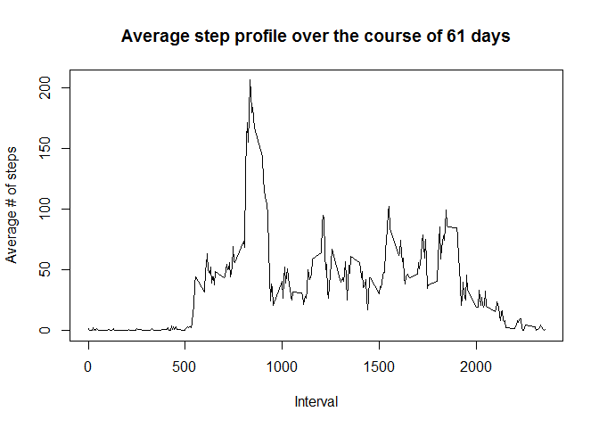

# Reproducible Research: Peer Assessment 1
Timothy Johnstone  


## Loading and preprocessing the data

The first step is to read in the data, which are stored in zip-compressed csv file. 


```r
setwd("Z:/Lotus/Dropbox/Coursera/5_Reproducible_Research/Projects/RepData_PeerAssessment1")
activity <- read.csv(unz('activity.zip','activity.csv'))
summary(activity)
```

```
##      steps                date          interval     
##  Min.   :  0.00   2012-10-01:  288   Min.   :   0.0  
##  1st Qu.:  0.00   2012-10-02:  288   1st Qu.: 588.8  
##  Median :  0.00   2012-10-03:  288   Median :1177.5  
##  Mean   : 37.38   2012-10-04:  288   Mean   :1177.5  
##  3rd Qu.: 12.00   2012-10-05:  288   3rd Qu.:1766.2  
##  Max.   :806.00   2012-10-06:  288   Max.   :2355.0  
##  NA's   :2304     (Other)   :15840
```

We also pre-process the dates to be stored as proper POSIX dates.


```r
activity$date <- as.Date(activity$date)
head(activity$date)
```

```
## [1] "2012-10-01" "2012-10-01" "2012-10-01" "2012-10-01" "2012-10-01"
## [6] "2012-10-01"
```

## What is mean total number of steps taken per day?

Let's take a look at the number of steps taken per day to get an idea of the dataset. Before doing this, we eliminate the NA values and then condense the steps by day.


```r
activityNoNA <- na.omit(activity)
stepsPerDay_sum <- aggregate(steps ~ date, activityNoNA,sum)
hist(stepsPerDay_sum$steps,
     col="steelblue",
     xlab="Steps per day", breaks=10,
     main="Distribution of steps per day over 61 days")
```

 

```r
meanSteps <- as.integer(mean(stepsPerDay_sum$steps))
medianSteps <- median(stepsPerDay_sum$steps)
```

The mean number of steps per day is  10766  
The median number of steps per day is  10765

## What is the average daily activity pattern?

Now, let's take a look at the average daily activity profile to see if we can elucidate any patterns in the user's activity. To do this, we aggregate the data by intervals (which are the same each day) and plot a timeseries.

```r
stepsPerInterval_average <- aggregate(steps ~ interval, activityNoNA,mean)
plot(stepsPerInterval_average$interval, stepsPerInterval_average$steps,
     type='l',
     xlab="Interval",
     ylab="Average # of steps",
     main="Average step profile over the course of 61 days")
```

 

Which interval has the highest average activity?


```r
maxAvgSteps <- as.integer(max(stepsPerInterval_average$steps))
maxAvgStepInterval <- stepsPerInterval_average$interval[which.max(stepsPerInterval_average$steps)]
```

The highest average activity occurs during interval 835, during which the user takes an average of 206 steps

## Imputing missing values

There are a number of NA (missing) values in this dataset. The first step is calculating the number of missing values:

```r
nrow(activity)-nrow(activityNoNA)
```

```
## [1] 2304
```

*Note: From a cursory glance it appears that the NAs are mostly concentrated within whole days rather than spread throughout. I would normally exclude these whole days rather than imputing their values due to the concentration of missing data (only imputing values for sporadic NAs from adjacent values), the assignment has us do otherwise.*  
To impute missing values, I will use the average (mean) steps for that interval rather than the average steps for that day since as we've seen in the previous part, the number of steps in an interval is time-of-day dependent. This can be fetched from the previously calculated averages using match(). Finally, we ensure that there are no NA values left in the table.

```r
activityImputedNA <- activity
activityImputedNA$steps <- ifelse(is.na(activityImputedNA$steps),
     stepsPerInterval_average$steps[match(activityImputedNA$interval,stepsPerInterval_average$interval)],
     activityImputedNA$steps)
sum(is.na(activityImputedNA$steps))
```

```
## [1] 0
```

Now, we replot the histogram as before, and check the new mean and median step values.

```r
stepsPerDay_sum <- aggregate(steps ~ date, activityImputedNA,sum)
hist(stepsPerDay_sum$steps,
     col="steelblue",
     xlab="Steps per day", breaks=10,
     main="Distribution of steps per day over 61 days")
```

 

```r
meanSteps <- as.integer(mean(stepsPerDay_sum$steps))
medianSteps <- as.integer(median(stepsPerDay_sum$steps))
```

A priori, I would not expect the mean to change, given that the previous values excluded NAs, and adding an additional mean value to a set then recalculating the mean will not change the mean. Since the median was so close to the mean, it likely will not change either or it will slightly shift towards the mean.

The mean number of steps per day is  10766  
The median number of steps per day is  10766

^ Indeed this is the case, the mean value has not changed as a result of the imputation, and the median value has shifted slightly closer to the mean. 

## Are there differences in activity patterns between weekdays and weekends?

The next step is to create a factor variable indicating whether a day is a weekday or not.


```r
wkdays <- weekdays(activityImputedNA$date)
activityImputedNA$daytype <- as.factor(ifelse(wkdays %in% c("Saturday","Sunday"),
              "weekend",
              "weekday"))
```

Finally, we aggregate the data to take the mean across all weekend/weekday days, and make a 2-panel plot to compare weekend and weekday activity


```r
stepsPerDayType_mean <- aggregate(steps ~ interval + daytype, activityImputedNA, mean)
library(lattice)
xyplot(steps ~ interval | daytype, stepsPerDayType_mean,
    type = "l", layout = c(1, 2), 
    xlab = "Interval",
    ylab = "Number of steps",
    col="gray50")
```

 

It looks like there's less of a 'morning commute' peak on the weekends, and generally more activity throughout the entire day.

